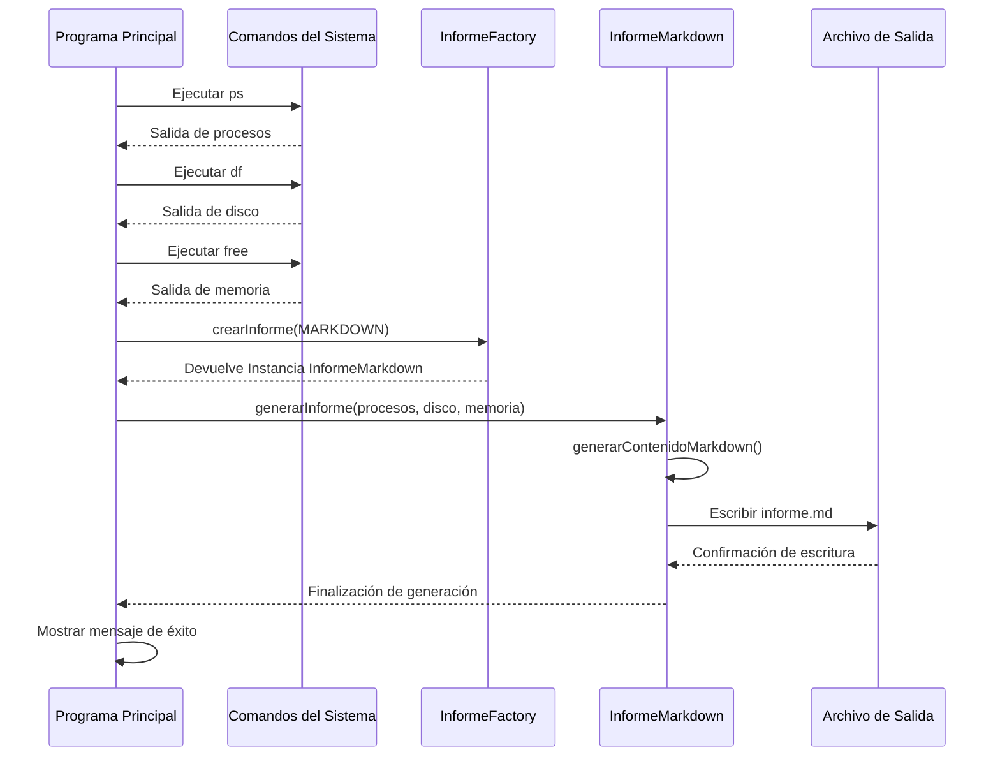

# Generador de Informes de Sistema

Este programa en Java ejecuta múltiples comandos del sistema operativo (`ps`, `df`, `free`) para recopilar información sobre el estado del sistema y genera un informe estructurado en formato Markdown. El proyecto utiliza el patrón de diseño Factory para facilitar la extensibilidad a diferentes formatos de informe.
> https://github.com/liuDam1/ejercicioInforme.git

## Diagrama de Secuencia



## Funcionalidad

El programa:

1. Lanza procesos hijos para ejecutar los comandos del sistema `ps`, `df` y `free`
2. Lee la salida de cada comando ejecutado
3. Utiliza el patrón Factory para crear una instancia del generador de informes Markdown
4. Genera un informe estructurado con la información recopilada
5. Guarda el informe en un archivo Markdown
6. Muestra un mensaje de éxito al usuario

## Descripción detallada

### 1. Ejecutar comandos del sistema

```java
String salidaPs = ejecutarComando(COMANDO_PS);
String salidaDf = ejecutarComando(COMANDO_DF);
String salidaFree = ejecutarComando(COMANDO_FREE);
```

En estas líneas, el proceso principal llama al método `ejecutarComando()` para crear procesos hijos que ejecutarán los comandos del sistema necesarios para recopilar información sobre procesos, uso de disco y memoria.

### 2. Crear instancia de generador de informes

```java
TipoInforme tipo = TipoInforme.MARKDOWN;
Informe informe = InformeFactory.crearInforme(tipo);
```

Aquí se utiliza el patrón de diseño Factory para crear una instancia del generador de informes. El tipo de informe se especifica como MARKDOWN, y el método `crearInforme()` devuelve una instancia de `InformeMarkdown`.

### 3. Generar el informe

```java
informe.generarInforme(salidaPs, salidaDf, salidaFree);
```

Se llama al método `generarInforme()` del generador creado, pasando como parámetros la salida de los comandos ejecutados anteriormente. Este método se encarga de procesar la información y generar el archivo de salida.

### 4. Interacción con procesos hijos

Dentro del método `ejecutarComando()`:

```java
private static String ejecutarComando(String[] comando, String entrada) throws IOException {
    // El proceso padre crea un proceso hijo
    Process proceso = Runtime.getRuntime().exec(comando);

    // Interacción de salida del padre hacia el hijo (si se proporciona entrada)
    if (entrada != null) {
        try (OutputStream output = proceso.getOutputStream();
                PrintWriter pw = new PrintWriter(new OutputStreamWriter(output))) {
            // El padre envía datos al hijo a través del flujo de salida del proceso
            pw.print(entrada);
            pw.flush();
        }
    }

    // Interacción de entrada del hijo hacia el padre (lectura de la salida del hijo)
    return leerSalida(proceso);
}
```

Este método crea un proceso hijo para ejecutar el comando especificado, permite enviar datos al proceso hijo si es necesario, y lee la salida del proceso hijo.

### 5. Lectura de la salida del proceso hijo

En el método `leerSalida()`:

```java
private static String leerSalida(Process proceso) throws IOException {
    StringBuilder resultado = new StringBuilder();
    try (BufferedReader lector = new BufferedReader(new InputStreamReader(proceso.getInputStream()))) {
        String linea;
        while ((linea = lector.readLine()) != null) {
            resultado.append(linea).append(SALTO_LINEA);
        }
    }
    return resultado.toString();
}
```

Este método lee la salida estándar del proceso hijo línea por línea, construyendo una cadena con toda la salida generada por el comando ejecutado.

### 6. Generación del contenido Markdown

En la clase `InformeMarkdown`:

```java
private String generarContenidoMarkdown(String ps, String df, String free) {
    SimpleDateFormat sdf = new SimpleDateFormat(FORMATO_FECHA);
    String fecha = sdf.format(new Date());
    
    StringBuilder contenido = new StringBuilder();
    
    // Cabecera del documento
    contenido.append(TITULO_PRINCIPAL).append(SALTO_LINEA);
    contenido.append(ETIQUETA_FECHA).append(fecha).append(SALTO_LINEA).append(SALTO_LINEA);
    
    // Sección de procesos
    contenido.append(SECCION_PROCESOS).append(SALTO_LINEA);
    contenido.append(CODIGO_BASH).append(SALTO_LINEA);
    contenido.append(ps).append(SALTO_LINEA);
    contenido.append(CIERRE_CODIGO).append(SALTO_LINEA).append(SALTO_LINEA);
    
    // Sección de espacio en disco
    contenido.append(SECCION_DISCO).append(SALTO_LINEA);
    contenido.append(CODIGO_BASH).append(SALTO_LINEA);
    contenido.append(df).append(SALTO_LINEA);
    contenido.append(CIERRE_CODIGO).append(SALTO_LINEA).append(SALTO_LINEA);
    
    // Sección de memoria
    contenido.append(SECCION_MEMORIA).append(SALTO_LINEA);
    contenido.append(CODIGO_BASH).append(SALTO_LINEA);
    contenido.append(free).append(SALTO_LINEA);
    contenido.append(CIERRE_CODIGO).append(SALTO_LINEA);
    
    return contenido.toString();
}
```

Este método genera el contenido del informe en formato Markdown, organizando la información en secciones claras y estructuradas.

## Manejo de errores

El programa incluye un manejo básico de errores que muestra un mensaje genérico si ocurre una excepción durante la ejecución de los comandos:

```java
try {
    // Código de ejecución
} catch (IOException e) {
    System.out.println(MSG_ERROR);
    System.exit(34);
}
```

## Flujo Completo de Ejecución

1. El proceso principal (Programa Java) inicia la ejecución.
2. Ejecuta el comando `ps` y lee su salida.
3. Ejecuta el comando `df` y lee su salida.
4. Ejecuta el comando `free` y lee su salida.
5. Utiliza el patrón Factory para crear una instancia de `InformeMarkdown`.
6. Llama al método `generarInforme()` con la información recopilada.
7. El generador de informes crea el contenido Markdown y lo escribe en un archivo.
8. Se muestra un mensaje de éxito al usuario.
9. El programa finaliza con código de salida 0.

## Explicación del patrón de diseño Factory

El patrón de diseño Factory se implementa a través de la clase `InformeFactory`:

```java
public class InformeFactory {
    public static final String MSG_TIPO_NO_SOPORTADO = "Tipo de informe no soportado: ";
    
    public static Informe crearInforme(TipoInforme tipo) {
        switch (tipo) {
            case MARKDOWN:
                return new InformeMarkdown();
                
            // Futuros tipos de informe
            // case XML:
            //     return new InformeXML();
            // case HTML:
            //     return new InformeHTML();
                
            default:
                throw new IllegalArgumentException(MSG_TIPO_NO_SOPORTADO + tipo);
        }
    }
}
```

Ventajas de este patrón en el proyecto:

1. **Desacoplamiento**: El código cliente (Main) no está acoplado a las clases concretas de generadores de informes.
2. **Extensibilidad**: Es fácil agregar nuevos formatos de informe sin modificar el código existente.
3. **Centralización**: La lógica de creación de instancias se centraliza en un solo lugar.

## Contenido del Informe Generado

El informe Markdown generado contiene las siguientes secciones:

1. **Título y fecha de generación**
2. **Procesos en Ejecución**: Salida del comando `ps`
3. **Uso del Disco**: Salida del comando `df`
4. **Uso de Memoria**: Salida del comando `free`